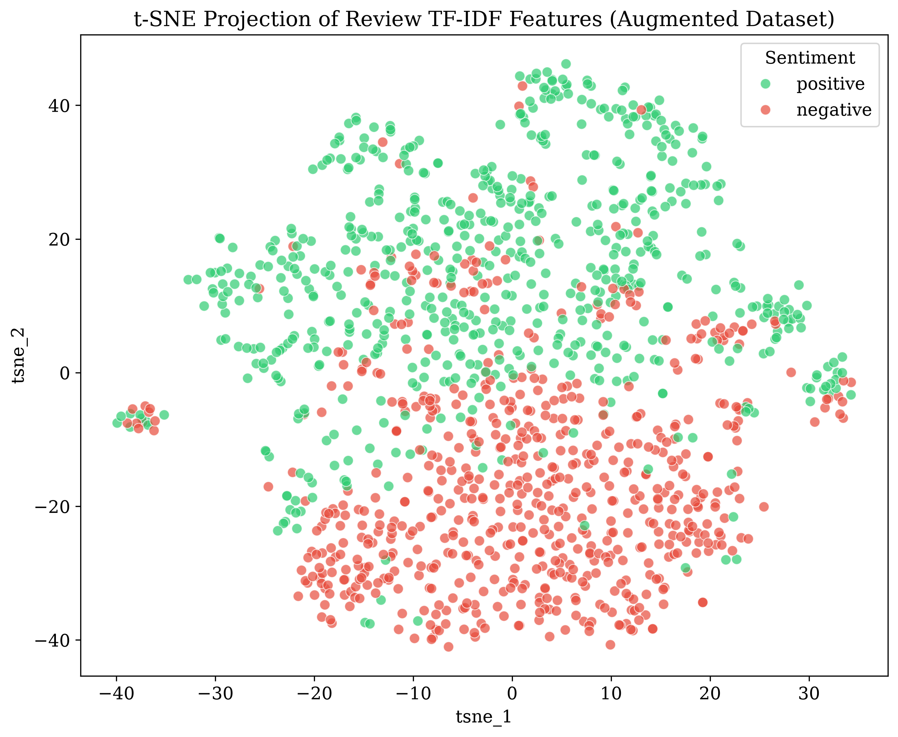
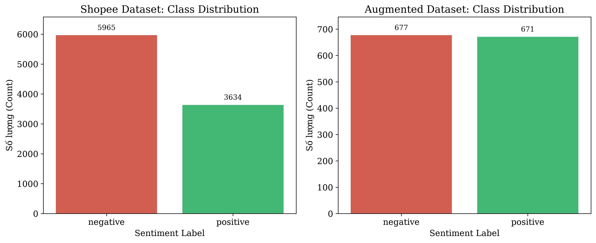
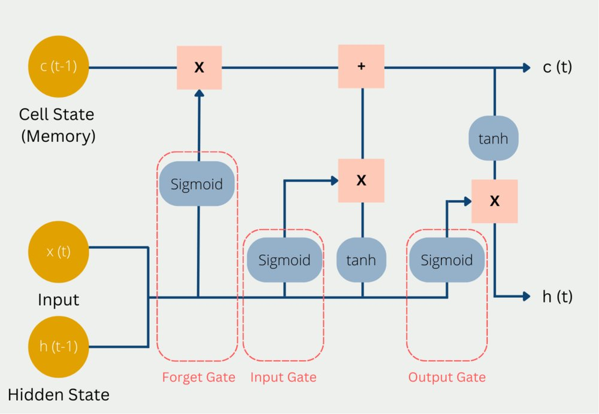
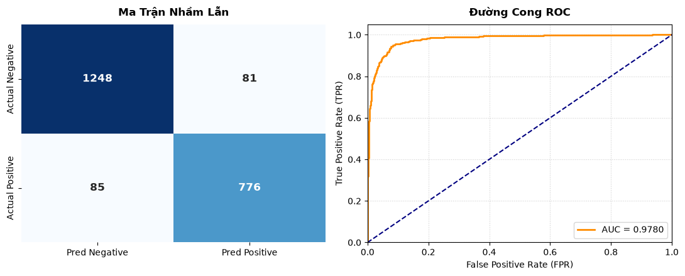
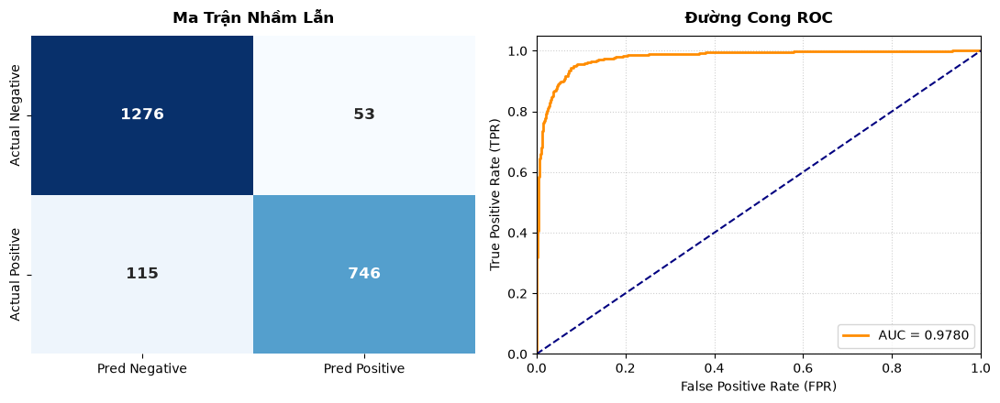
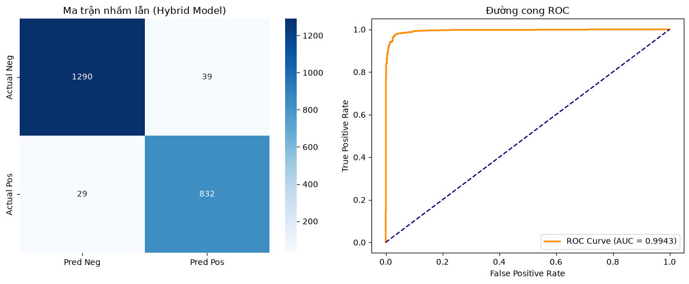

# Nhóm 1: Giới thiệu

| MSSV     | Họ tên             | Tasks | Mức độ đóng góp (%) |
|----------|--------------------|-------|---------------------|
| 24280027 | Lâm Nhật Tiến      |   Text Preprocessing, Viết báo cáo    | 15                  |
| 24280094 | Đỗ Quang Phong     |   Text Preprocessing, Viết báo cáo    | 15                  |
| 24280026 | Phạm Thị Diệu Thùy |    EDA   | 14                  |
| 24280028 | Phạm Quốc Triều    |    Baseline Models   | 14                  |
| 24280068 | Trương Đình Hưng   |    Feature Engineer   | 14                  |
| 24280102 | Nguyễn Hoàng Sang  |    LSTM Model   | 14                  |
| 24280109 | Tô Ngọc Tiến       |    PhoBERT Model   | 14                  |
<br>

"Hạnh phúc là quá trình, không phải kết quả"

# A. Vấn đề và một cách giải quyết của nhóm 
### Vấn đề:
* Trong kinh doanh, bán hàng online trong hiện tại đã và đang bước vào thời kỳ hoàng kim, số doanh nghiệp, số lượng đơn hàng trực tuyến tăng vọt. Vì vậy, các vấn đề về việc phân tích và cải thiện doanh số của các doanh nghiệp cũng theo đó mà tăng vọt, và một trong đó là **phân tích các đánh giá của khách mua hàng**. Đây là một vấn đề khó khăn một khi số đánh giá tăng lên quá nhiều, ta không thể nào đọc từng dòng hoặc có thể thuê người đọc, đánh giá và lọc, nhưng sẽ vô cùng mất thời gian và tốn kém. Vậy giải quyết vấn đề như thế nào bây giờ? 

### Một lời giải của nhóm: 
* Trong thời đại mà đến cảm xúc còn có thể được cài đặt cho máy móc thì việc ta không dùng đến chúng là một sự lỗi thời và xuống cấp mạnh của hiệu suất công việc. Vì vậy theo nhóm, một giải pháp tân thời, ta có thể sử dụng **mô hình học máy** để phân tích và phân loại tính chất của nhận xét. 
* Giới thiệu sơ bộ về mô hình mà nhóm dùng: Long Short-Term Memory (hay LSTM) là một mô hình học sâu được cải tiến dựa trên RNNs (Recurrent Neural Networks) với ý tưởng đại khái là máy móc sẽ "đọc" từng chữ, "nhớ", "đánh giá" rồi "phân loại"(Ý tưởng sẽ được giải thích rõ hơn ở phần sau).


--- 

# B. Mô tả chi tiết

## Phần 1: Dữ liệu
### Nguồn:
Dữ liệu được chia sẻ trên trang Kaggle. Link: https://www.kaggle.com/datasets/dduongdev/shopee-vietnamese-product-reviews-sentiment

### Mô tả dữ liệu: 
Dữ liệu gồm hơn 10000 dòng dữ liệu được chia vào thành 2 tập shoppee và augmented về đánh giá sản phẩm trên shoppee của các doanh nghiệp bán lẻ, gồm 4 cột:
```text
id  |  review   |   rating  |   label
```
Ý nghĩa của các cột:
- **id**: Khóa chính, là mã số của đánh giá.
- **review**: Chứa đánh giá của các khách hàng.
- **rating**: Số sao mà khách hàng đánh giá cho sản phẩm.
- **label**: Nhãn thật sự của đánh giá.  

Theo các phân tích, bộ dữ liệu khá sạch khi về căn bản không có dòng nào chứa null, không có dòng bị trùng lặp, các nhãn được ghi đầy đủ.
- Review dài nhất chứa 2021 ký tự, ngắn nhất 20 ký tự.
- Trong bộ dữ liệu gốc cũng chứa các ký tự lạ, emoji/icon, có chứa từ sai chính tả, có từ bị kéo dài  

### EDA:
#### 1/ Trực quan hóa không gian đặc trưng bằng t-SNE (Feature Separability Analysis)

<div align="center" style="font-weight: bold"> t-SNE Projection of Review TF-IDF Features (Shopee Dataset) </div>


**Nhận xét:** Biểu đồ cho thấy **hai nhóm cảm xúc** (`positive` và `negative`) có **sự chồng lấn (overlap) tương đối lớn**, nhưng vẫn **bộc lộ xu hướng phân cụm (clustering trend) theo vùng rõ rệt**.
- Các đặc trưng TF-IDF thuần túy (tần suất từ) ở mức cơ bản đủ để thuật toán nhận diện được sự khác biệt giữa hai sắc thái, nhưng chưa đủ mạnh để phân tách chúng thành hai cụm hoàn toàn biệt lập.

<div align="center" style="font-weight: bold"> t-SNE Projection of Review TF-IDF Features (Augmented Dataset) </div>


**Nhận xét:** Biểu đồ cho thấy **khả năng phân tách tuyến tính (separability) giữa hai nhãn cảm xúc đã được cải thiện rõ rệt** so với tập dữ liệu Shopee gốc.
- Thay vì trộn lẫn phức tạp ở khu vực trung tâm, hai cụm dữ liệu giờ đây đã phân hóa theo trục dọc (`tsne_2`). Nhãn `positive` (màu xanh) chiếm lĩnh hoàn toàn nửa trên của không gian biểu đồ, trong khi nhãn `negative` (màu đỏ) tập trung chủ yếu ở nửa dưới.

#### 2/ Phân phối số lượng mẫu và nhãn
<div align="center" style="font-weight: bold"> Biểu đồ phân phối nhãn </div>



**Nhận xét:** Biểu đồ trên cho thấy 
- **Tập dữ liệu gốc (Shopee Dataset)**  
  - **Phân bố**: Nhãn `negative` chiếm ưu thế áp đảo với **5,965 mẫu**, trong khi nhãn `positive` chỉ có **3,634 mẫu**.
  - **Đặc trưng:** Nhóm tiêu cực chiếm khoảng $62%$ tổng số dữ liệu. Hơi là lạ, doanh nghiệp này có lẽ cần phải kiểm tra lại phương thức bán hàng. Nhưng với vấn đề học máy, đây chỉ là một sự lệch dữ liệu nhỏ, không đáng kể, không ảnh hưởng quá sâu sắc đến khả lăng học, chỉ hơi bias nhẹ một tí cho nhãn `negative` thôi.

- **Tập dữ liệu tăng cường (Augmented Dataset)**
  - **Phân bố:** Nhãn`negative` có **677 mẫu** và `positive` có **671 mẫu**.
  - **Đặc trưng:** Việc chủ động đưa tỷ lệ về mức xấp xỉ $50:50$ giúp loại bỏ hoàn toàn yếu tố thiên vị class khi huấn luyện.  
  <br>


<div align="center" style="font-weight: bold"> Biểu đồ phân phối rating của khách hàng </div>


**Nhận xét:** Nhìn chung, cấu hình phân bổ điểm đánh giá giữa hai tập dữ liệu giữ **nguyên hình dáng tổng thể** (distribution shape). Cả hai đều mang đặc trưng của dữ liệu đánh giá thương mại điện tử thực tế: **Phân hóa mạnh về hai đầu cực đoan** (tập trung rất nhiều vào `1 sao` và `5 sao`, cực kỳ ít ở `4 sao`).

Điều này chứng tỏ quá trình lấy mẫu (sampling) hoặc trích xuất để tạo tập `Augmented Dataset` đã **bảo toàn khá tốt tỷ lệ cấu trúc rating gốc**, không làm lệch phân phối điểm số ban đầu của người dùng.

#### 3/ Mối quan hệ giữa điểm đánh giá và nhãn cảm xúc
<div align="center" style="font-weight: bold"> Biểu đồ cột thể hiện mối quan hệ giữa nhãn và đánh giá </div>


**Nhận xét:** Biểu đồ này thể hiện một sự thật quan trọng: **Tập dữ liệu gốc (Shopee) bị nhiễu nhãn (Label Noise) rất nặng**, đặc biệt ở các dải điểm trung gian như `3 sao` và `4 sao` ***(Cần thêm lý do vào đây)***. Khi sang tập **Augmented Dataset**, mặc dù cấu trúc phân phối rating được giữ nguyên, nhưng mối quan hệ gán nhãn đã được phân định rạch ròi và "sạch" hơn đáng kể.

Do đồ thị dùng trục tung dạng **Log Scale**, các thanh bar thấp nhìn có vẻ không chênh lệch nhiều, nhưng thực tế số lượng chênh lệch tuyến tính là cực kỳ lớn.

#### 4/ Kết luận chung sau EDA
<div align="center" style="font-weight: bold"> Tổng quan cấu trúc hệ thống dữ liệu </div>

| Đặc trưng phân tích | Tập dữ liệu gốc (Shopee Dataset) | Tập dữ liệu tăng cường (Augmented Dataset) |
| :--- | :--- | :--- |
| **Số lượng mẫu** | 9,599 mẫu (Khá lớn) | 1,348 mẫu (Đã qua lọc/Downsampling) |
| **Cân bằng nhãn** | Mất cân bằng nghiêm trọng (62% Negative : 38% Positive) | **Cân bằng lý tưởng (50% Negative : 50% Positive)** |
| **Quy tắc gán nhãn** | Bị nhiễu nặng (Label Noise) ở mức 3 và 4 sao | Được làm sạch và chuẩn hóa triệt để theo mức Rating |
| **Độ dài văn bản** | Phân phối tự nhiên (Negative dài hơn Positive một chút) | Nhân tạo (Negative bị kéo dài bất thường, tối đa ~155 từ) |
| **Không gian ngữ nghĩa** | Chồng lấn mạnh ở trung tâm (Từ vựng trung tính nhiều) | **Phân tách tuyến tính rõ rệt trên trục dọc t-SNE** |

**Caution:** Bộ dữ liệu Augmented quá "đẹp", quá "hoàn hảo", nhưng ông cha ta nói, cái gì quá cũng không tốt. Trong trường hợp này sự đẹp đó sẽ khiến mô hình sẽ học vẹt, và khi đưa  mô hình này deploy dự đoán các đánh giá tự nhiên ngoài đời thực, độ chính xác giảm là điều mà ta không thể tránh (Drop Performance).

### Preprocessing
Trong phần này, ta xem như đã gộp 2 dataset trên thành 1 để dễ hoạt động, tuy nhiên đối với mỗi mô hình, yêu cầu dữ liệu đầu vào là khác nhau, nên nhóm chia thành hai nhánh xử lí:
- Một nhánh cho baseline model, tức là những model đơn giản như SVM, -> Cần xử lí dữ liệu đầu vào phức tạp hơn, kỹ hơn một tí
- Một nhánh cho neural network model, như LSTM hay PhoBERT -> Không cần xử lí quá kỹ, để giữ được nhiều thông tin hơn.
</br>

#### 1/ Clean text
Trong phần này, trước hết, cần xử lí chung cho cả hai mô hình những điều như sau:
- Chuẩn hóa khoảng trắng: loại bỏ các khoảng trắng dư thừa trong các câu.
- Chuyển emoji thành dạng chữ: ở đây chúng em xử lí đơn giản bằng cách mapping các emoji thông dụng thành các dạng `positive_emoji`, `negative_emoji`, ...
- Loại bỏ URL, HTML, email được dán kèm trong review.

Riêng đối với mô hình baseline, ta cần xử lí khắc khe hơn một vài điều sau:
- Chuyển chữ hoa thành chữ thường
- Loại bỏ dấu câu

#### 2/ Normalize text
Một trong những quy trình khó khăn nhất trong preprocessing, khi hiện tại vẫn có khá ít thư viện có thể xử lí một cách triệt để tiếng Việt. Một số điều nhóm em đã xử lí như sau:
- **Chuẩn hóa lại các từ bị kéo dài:** ví dụ như "Phongggggg đẹpp trai" -> "Phongg đẹpp trai". Nhóm áp dụng kiểu chuyển nếu chứa từ 3 chữ lặp lại trở lên thì mới giảm xuống còn hai vì hai lý do chính: 
    - Tránh loại bỏ mất các từ tiếng anh như free, good,... (lí do chính)
    - Giữ lại một tí thông tin, khi các từ kéo dài thường biểu thị cảm xúc "mạnh" hơn (lí do phụ)
<br>

- **Chuẩn hóa các từ viết tắt/slang:** Ở đây bọn em cũng chỉ dùng một cách đơn giản là mapping lại một số từ thông dụng rồi chuyển đổi lại thành dạng câu văn đầy đủ
<br>

- **Đổi từ tiếng việt không dấu sang có dấu:** Đây là một vấn đề thật sự nan giải, nó giải quyết các vấn đề như sự đồng bộ hóa giữa các từ, tuy nhiên nó cũng khiên phát sinh các vấn đề bên lề. Cụ thể nhóm em xử lí như sau:
    - Duyệt qua các từ trong tập dữ liệu. Với mỗi từ ta lưu lại tần suất nghĩa gốc sau đó chuyển về dạng không dấu. Ví dụ: Gặp từ `bạn` -> chuyển thành `ban`  -> đếm ` bạn` ứng với ` ban ` một lần 
    - Chọn từ có tần suất cao nhất trong cùng dạng. Ví dụ trong các từ `ban` thì từ `bạn` có tần suất cao nhất lưu lại qua `restore_map`.
    - Xử lí từng cụm. Ví dụ như `chat luong` sẽ đổi sang thành ` chất lượng `.
    - Tách câu và kiểm tra từng từ đơn, nếu từ đã có dấu thì giữ nguyên, nếu không dấu thì dò trong ` restore map ` rồi đổi.
<br>

Riêng đổi với bộ dữ liệu dành cho các mô hình baseline, ta cần loại bỏ các stopword để giảm noise và tăng hiệu suất lưu trữ. Bộ stopword được tải về từ link: https://stopwords.github.io/vietnamese-stopwords/ của tác giả Le Van Duyet.

#### 3/ Segmentation & Tokenize:
- Vì đặc thù của tiếng Việt, một vài từ cần có nhau thì mới có được ý nghĩa. Vậy, để ghép các từ đơn chiếc lại, bọn em dùng các thư viện chuyên xử lí tiếng Việt đã có sẵn như underthesea, pyvi để phân đoạn các từ. Sau đó lưu lại vào folder tạm dành cho xử lí các phần sau.
- Tương tự, để mã hóa các từ trong reviews, nhóm cũng tận dụng tối đã nguồn trí lực dồi dào của các bậc tiền bối bằng các tận dụng luôn các thư viện như sklearn để tách các từ với nhau, chuẩn bị cho máy học.

## Phần 2: Máy móc bumchacalaca
Vì đây là bài toán phân loại, đánh giá có tích cực hay không, nhóm em thử nghiệm trên các mô hình chính như sau:
- Deep Learning:
  - LSTM
  - PhoBERT của VinAI

- Baseline (ML):
  - Logistic Regression
  - Naive Bayes
  - SVM


### 1. Feature Engineer


Sau bước tiền xử lý, dữ liệu văn bản đã được làm sạch và phân tách từ. Tuy nhiên, các thuật toán Machine Learning không thể làm việc trực tiếp với chuỗi ký tự mà chỉ xử lý được dữ liệu dạng số. Do đó, bước Feature Engineering được thực hiện nhằm chuyển đổi văn bản thành các vector số mang thông tin ngữ nghĩa, tạo đầu vào cho các mô hình học máy và học sâu.

---

### 1.1 TF-IDF

### Bước thực hiện

* Xây dựng tập từ vựng từ toàn bộ dữ liệu.
* Tính giá trị TF (Term Frequency) cho từng từ trong mỗi văn bản, dựa trên giả định từ xuất hiện càng nhiều trong document thì càng quan trọng => TF gần 1 thì quan trọng
* Tính giá trị IDF (Inverse Document Frequency) dựa trên toàn bộ tập dữ liệu, với ý tưởng rằng một từ xuất hiện ở quá nhiều document khác nhau thì ít có khả năng phân biệt các document => IDF lớn thì có tính phân biệt cao
* Tạo vector TF-IDF biểu diễn mỗi văn bản bằng cách tính TF*IDF.

TF-IDF biểu diễn một văn bản thông qua mức độ quan trọng của các từ xuất hiện trong văn bản đó. Những từ xuất hiện nhiều trong một văn bản nhưng ít xuất hiện trong toàn bộ tập dữ liệu sẽ được gán trọng số cao hơn.


Mỗi văn bản được chuyển thành một vector đặc trưng có kích thước cố định.

### Ý nghĩa

* Giảm ảnh hưởng của những từ xuất hiện quá phổ biến.
* Tăng trọng số cho các từ mang nhiều thông tin hơn.
* Giải quyết được điểm yếu của Bag of Words khi phản ánh được độ quan trọng của từ qua các trọng số.

Hạn chế:

* Không nắm bắt được ý nghĩa ngữ nghĩa giữa các từ. Ví dụ như sự mơ hồ của các từ đồng âm, từ đa nghĩa, cần thêm các từ khác để có được nghĩa rõ ràng. TF-IDF chỉ hiểu `yếu` trong `điểm yếu` và `yếu` trong `yếu điểm` là một.
* Không hiểu được những từ khác nhau nhưng gần nghĩa, ví dụ `tốt` và `tuyệt vời`. Do đó TF-IDF sẽ cho ra các vector khác nhau cho những câu có nghĩa gần giống nhau.
* Chưa khắc phục được những điểm yếu của Bag of Words về mất thứ tự từ và khả năng mở rộng cho tập dữ liệu lớn rất kém.

---

### 1.2 Word2Vec

### Bước thực hiện

Ý tưởng chính: **các từ xuất hiện trong các ngữ cảnh giống nhau thì có nghĩa giống nhau**. Word2Vec sẽ học 2 nhiệm vụ phụ: dự đoán từ dựa trên ngữ cảnh hoặc dự đoán ngữ cảnh dựa trên từ. Các bước thực hiện có thể giản lược như sau:
* Tạo dictionary vocabulary và tách mỗi câu thành 1 one-hot vector dựa trên dictionary đó.
* Huấn luyện 1 mô hình neural network đơn giản trên toàn bộ tập dữ liệu. Trong đó, kiến trúc sẽ là input layer - embedding layer (hidden layer) - output layer. 
* Sau khi huấn luyện sẽ có được các trọng số của hidden layer, ta sẽ dùng nó để biến đổi bất kỳ từ nào trong dictionary vocabulary.
* Sau đó, các vector của từng từ được tổng hợp lại bằng Average Pooling (lấy trung bình của các vector) để tạo thành vector biểu diễn cho toàn bộ câu hoặc văn bản.

### Ý nghĩa

Word2Vec học mối quan hệ ngữ nghĩa giữa các từ thông qua ngữ cảnh xuất hiện của chúng. Từ đó:
* Biểu diễn được ý nghĩa ngữ nghĩa của từ.
* Giảm số chiều đặc trưng so với TF-IDF.
* Giúp các từ có ý nghĩa tương tự được biểu diễn gần nhau.

Hạn chế:

* Không xử lý tốt từ hiếm. Các vector hiếm sẽ không được học đủ để ảnh hưởng nhiều lên trọng số nên vector đầu ra sẽ khó để thể hiện các từ hiếm. 
* Không hiểu cấu trúc bên trong của từ, do đó rất nhạy với lỗi chính tả, viết tắt, thiếu dấu hay các ký tự lặp kéo dài. Nếu preprocess không đủ tốt thì Word2Vec không xử lý được.
* Chưa khắc phục được điểm yếu của TF-IDF về sự mơ hồ của từ đa nghĩa, mất thông tin về thứ tự từ.

---

### 1.3 FastText

### Bước thực hiện

Khác với Word2Vec, FastText không coi một từ là đơn vị độc lập mà phân tích từ thành nhiều chuỗi ký tự nhỏ hơn. Ý tưởng chính là một từ là tập hợp của nhiều mảnh ký tự nhỏ hơn (character n-grams). Ví dụ: `tốt` được biểu diễn thông qua nhiều character n-grams.

* Tách văn bản thành các từ. Các từ được biến đổi thành nhiều vector n-grams có hình dáng gần giống nhau.
* Huấn luyện mô hình neural network FastText tương tự như Word2Vec trên toàn bộ tập dữ liệu, chỉ khác là input layer là các vector n-grams.
* Dùng kết quả từ neural network ở trên để sinh vector biểu diễn cho từng từ.
* Tính trung bình các vector từ để tạo vector biểu diễn cho toàn bộ văn bản.

### Ý nghĩa


* Tạo vector tốt hơn cho những từ ít xuất hiện hoặc bị sai chính tả. Từ đó, khắc phục hạn chế của Word2Vec đối với các từ hiếm, từ bị lỗi.
* Hoạt động tốt trên dữ liệu tiếng Việt và dữ liệu mạng xã hội.
* Không còn quá nhạy với lỗi chính tả và các biến thể của từ.

Hạn chế:

* Vẫn làm mất thứ tự từ khi sử dụng trung bình vector.
* Không giải quyết được vấn đề đa nghĩa vì một từ thì chỉ sinh ra những vector gần giống. Nhưng ví dụ như từ `yếu` khi trong ngữ cảnh khác nhau sẽ có nghĩa hoàn toàn trái ngược, nên cần 2 vector khác nhau.

---

### Kết quả đầu ra

Sau bước Feature Engineering, mỗi văn bản được chuyển đổi thành một vector đặc trưng có kích thước cố định.

Các vector này sẽ được sử dụng làm đầu vào cho các mô hình học máy như:

* Logistic Regression
* Naive Bayes
* Support Vector Machine

hoặc làm đầu vào cho các mô hình học sâu như:

* LSTM
* Transformer
* PhoBERT

Nhờ đó, mô hình có thể học được các mẫu dữ liệu và thực hiện nhiệm vụ phân loại cảm xúc trên các đánh giá của khách hàng.

---

### 2. Baseline Model

Ở các model baseline, nhóm chỉ dùng kết quả của TF-IDF để train model, chưa dùng tới các kết quả nâng cao hơn.

### 2.1 Logistic Regression

### Thuật toán

Thuật toán của Logistic Regression có thể hiểu đơn giản là *dùng thuật toán Linear Regression và biến đổi đầu ra bằng hàm Sigmoid (hoặc Softmax) để đưa ra kết quả classification*. Cụ thể tuần tự các bước là:
* Khởi tạo các trọng số W
* Tính một siêu phẳng mô tả tất cả các điểm dữ liệu
* Dùng hàm sigmoid để chuyển kết quả của siêu phẳng thành một xác suất thuộc vào class nào. Vì đây là bài toán binary classification nên dùng hàm sigmoid, kết quả trả về là một giá trị xác suất **p** thuộc khoảng [0;1]. Cho threshold là 0.5 thì khi **p>0.5, điểm dữ liệu thuộc class 1** và ngược lại 
* So sánh với label để tính loss và dùng Gradient Descent để cập nhật trọng số W
* Tiếp tục cho đến khi đạt điều kiện dừng là hàm mục tiêu hội tụ hoặc dừng sớm (chạy đủ số epoch hoặc loss đủ nhỏ)


### Đánh giá

| Class | Precision | Recall | F1-score |
| :--- | :---: | :---: | :---: |
| negative | 0.95 | 0.92 | 0.93 |
| positive | 0.88 | 0.92 | 0.90 |


Kết quả các metric trả về rất tốt dù chỉ mới là baseline
=> Bộ dữ liệu không thật sự mang tính đại diện, vì dữ liệu thực tế của bài toán NLP không dễ gì mà đạt kết quả cao như vậy chỉ với baseline, nếu không thì đã chẳng cần tới các kỹ thuật Deep Learning.

Dựa trên thuật toán của Logistic Regression và TF-IDF có thể nhận xét:
* Dù số chiều của matrix mà TF-IDF trả về là rất lớn nhưng model vẫn được train rất nhanh. Lý do là vì các vector đặc trưng phần lớn là các giá trị 0, rất thưa, nên không ảnh hưởng tốc độ tính toán của model.
* Model Logistic Regression có tính giải thích được vì kết quả trả về là một giá trị xác suất, dựa vào đó ta quyết định classify điểm dữ liệu tùy vào threshold được chọn.
* Model vẫn có các điểm yếu chưa khắc phục được từ phần trước đã nêu, đó là không học được thứ tự từ, ngữ nghĩa và ngữ cảnh của câu.
* Ngoài ra, do train dựa trên giả sử về mối quan hệ tuyến tính của các feature nên model không thể học các mối quan hệ phức tạp.

---

### 2.2 Naive Bayes

### Thuật toán

Thuật toán Naive Bayes hoạt động dựa trên giả sử về tính độc lập của các feature. Thuật toán xem các feature là hoàn toàn độc lập với nhau để tính xác suất có điều kiện theo định lý Bayes. Cụ thể:
* Tính xác suất xảy ra của từng class
* Tính xác suất mỗi từ xuất hiện trong từng class
* Khi predict một review, model tính xác suất có điều kiện cho class 0 và class 1. Nói cách khác, khi có các từ như trong review xuất hiện thì xác suất thuộc class 1 (hay 0) là bao nhiêu. Xác suất class nào lớn hơn thì review sẽ thuộc class đó.

### Đánh giá

| Class | Precision | Recall | F1-score |
| :--- | :---: | :---: | :---: |
| negative | 0.96 | 0.87 | 0.91 |
| positive | 0.82 | 0.94 | 0.88 |

Đánh giá về metric thì tương tự như Logistic Regression.

Dựa trên thuật toán ta có thể có một số nhận xét:
* Đây là **model train nhanh nhất** trong tất cả các model mà nhóm sử dụng. Lý do là vì model không có learnable param mà chỉ là thuần tính toán các phép nhân chia.
* Các điểm về tính giải thích được và điểm yếu chưa thể khắc phục thì Naive Bayes khá giống với Logistic Regression (dù lý do đằng sau thì khác nhau).
* Ngoài ra, việc giả định tính độc lập giữa các feature là không tốt vì các từ thường phụ thuộc nhau để quyết định nghĩa cả câu.

---

### 2.3 Support Vector Machine

### Thuật toán

SVM cố gắng tìm một siêu phẳng để phân chia các class trong không gian dữ liệu (decision boundary). Ta tìm sao cho khoảng cách từ siêu phẳng đến các điểm gần nhất của mỗi class là lớn nhất. Thuật toán cụ thể:
* Khởi tạo siêu phẳng ngẫu nhiên
* Tìm các support vector (những điểm gần đường phân chia nhất)
* Điều chỉnh siêu phẳng sao cho khoảng cách giữa siêu phẳng và các support vector là lớn nhất
* Lặp lại cho đến khi tìm được siêu phẳng tối ưu
* Khi predict một review, input vector sẽ được đưa vào phương trình của siêu phẳng. Nếu kết quả dương thì thuộc class 1, kết quả âm thì thuộc class 0.

### Đánh giá

| Class | Precision | Recall | F1-score |
| :--- | :---: | :---: | :---: |
| negative | 0.96 | 0.92 | 0.94 |
| positive | 0.88 | 0.94 | 0.91 |

Kết quả metric tốt nhất trong cả 3 baseline model. Mặc dù chưa tune hyperparameter nhưng model đã đạt kết quả rất cao, càng khẳng định giả định về tính đại diện thấp của bộ dữ liệu là đúng.

Nhận xét:
* SVM khó giải thích hơn 2 model trên vì nó không trả về một xác suất thuộc vào một class.
* Model có tính chính xác cao, có thể là cao nhất trong 3 model baseline.
* Không học được thứ tự từ, ngữ cảnh, train chậm khi dữ liệu lớn.

### Mô hình Long Short-Term Memory(LSTM):
#### 1/ LSTM là gì vậy nhỉ? Một lời giới thiệu.
- LSTM là một mô hình học sâu thừa hưởng từ RNNs (tìm hiểu thêm) chuyên xử lí các bài toán có tính tuần tự liên tục, thông qua các dữ kiện diễn ra trước để đoán kết quả diễn ra sau. Vậy ta tự hỏi phân tích chữ thì liên quan gì đến tuần tự? Để giải đáp câu hỏi này, ta cứ nghĩ máy sẽ "đọc" từng chữ từng chữ rồi đưa ra phân tích, cứ như cách con người đọc vậy thôi. 
- LSTM là một chuỗi các khối (cells) được cấu tạo từ 3 phần chính: cổng quên, cổng đầu vào, cổng ra. Ta hiểu mỗi một cell sẽ đánh giá một chữ, đưa input vào tạo thông tin mới, thừa hưởng thông tin từ cell trước (trừ cell đầu tiên) rồi xuất thông tin đạt được ra.



<div align="center" style="font-weight: bold"> Hình cấu tạo của một cells. Link: https://vnptai.io/storage/thumbnail/LSTM-la-gi.jpg </div>

<br>

#### 2/ Cài đặt mô hình
Nhóm em cài đặt mạng mô hình Bidirectional LSTM sử dụng thư viện pytorch và thừa hưởng các hàm đã có:
- Khởi tạo mô hình:

```python
def __init__(self, vocab_size=64001, embedding_dim=128, hidden_dim=256, output_dim=1, n_layers=2):
  super().__init__()
        
  # 1. Tầng nhúng từ (Embedding Layer) - Nhận ma trận 2D [Batch, 128] -> Trả về 3D [Batch, 128, 128]
  # padding_idx=1 (Bỏ hết pad_idx = 1) vì PhoBERT Tokenizer của VinAI quy ước ID số 1 là ký tự đệm (Pad) để đáp ứng đủ độ dài chuỗi      
  self.embedding = nn.Embedding(vocab_size, embedding_dim, padding_idx=1)      
        
  # 2. Tầng mạng hồi quy LSTM 2 chiều (Bidirectional LSTM)
  self.lstm = nn.LSTM(embedding_dim, 
                      hidden_dim,  # Nhận vào vector kích thước 128, đầu ra tại mỗi bước thời gian là một vector ngữ cảnh kích thước 256
                      num_layers=n_layers, 
                      batch_first=True, # Đảm bảo input: [Batch, Seq_len, Embed_dim]
                      bidirectional=True, # Học ngữ cảnh xuôi và ngược
                      dropout=0.3 if n_layers > 1 else 0.0) # dropout giúp chống học vẹt, ngắt ngẫu nhiên 30% neuron giữa các tầng để có thể huấn luyện bền vững hơn
        
  # 3. Tầng tuyến tính phân loại đầu ra (Fully Connected)
  # Nhân đôi hidden_dim vì cơ chế Bidirectional gộp kết quả chiều xuôi + chiều ngược lại với nhau
  self.fc = nn.Linear(hidden_dim * 2, output_dim)
  self.sigmoid = nn.Sigmoid()      # Hàm kích hoạt để ép số về khoảng từ [0,1]
```
- Lan truyền thuận (Forward Prop):
```python
def forward(self, text):
  # text shape đầu vào: [batch_size, sequence_length] (Ví dụ: [64, 128])
  embedded = self.embedding(text) # shape sau embedding: [batch_size, 128, 128]
  
  # Chạy qua mạng LSTM
  lstm_out, (hidden, cell) = self.lstm(embedded)
  
  # Trích xuất hidden state cuối cùng của chiều xuôi (forward) và chiều ngược (backward)
  hidden_forward = hidden[-2, :, :]
  hidden_backward = hidden[-1, :, :]
  
  # Nối (Concatenate) 2 chiều lại thành một vector ngữ cảnh duy nhất đại diện cho cả câu
  hidden_concat = torch.cat((hidden_forward, hidden_backward), dim=1) # shape: [batch_size, hidden_dim * 2]
  
  # Đưa qua tầng tuyến tính và kích hoạt Sigmoid để tính xác suất (từ 0 đến 1)
  dense_out = self.fc(hidden_concat)
  return self.sigmoid(dense_out) # Trả về giá trị xác suất có là Positive hay không
```
- Hàm loss:
```python
# Dùng Binary Cross Entropy Loss vì đây là bài toán phân loại nhị phân (Positive/Negative)
criterion = nn.BCELoss()
```
- Hàm optimizer:
```python
# Dùng Adam Optimizer với learning rate vừa phải để mô hình hội tụ mượt mà
optimizer = optim.Adam(model.parameters(), lr=0.0002, weight_decay=0.00001)
```
#### 3/ Đánh giá mô hình
- Thời gian và độ chính xác khi huấn luyện dựa trên 3 epochs
```markdown
--- Epoch 1/3 ---
Train Loss: 0.1399 | Train Acc: 95.08%
Test Loss:  0.2014 | Test Acc:  92.65%

--- Epoch 2/3 ---
Train Loss: 0.1182 | Train Acc: 96.13%
Test Loss:  0.2054 | Test Acc:  92.30%

--- Epoch 3/3 ---
Train Loss: 0.1044 | Train Acc: 96.47%
Test Loss:  0.1948 | Test Acc:  92.59%
Train time on mps: 56.642 seconds
```
-> Nhận xét: Thời gian huấn luyện khá nhanh cho một mạng nơ ron. Độ chính xác cũng khá ổn
<br>

- Độ chính xác tổng thể dựa trên tập test gồm 2190 quan sát.
```markdown
=============== BÁO CÁO HIỆU SUẤT TỔNG HỢP ===============
              precision    recall  f1-score   support

    Negative     0.9362    0.9391    0.9376      1329
    Positive     0.9055    0.9013    0.9034       861

    accuracy                         0.9242      2190
    macro avg     0.9209    0.9202    0.9205      2190
  weighted avg     0.9241    0.9242    0.9242      2190
```

- Biểu đồ 

<br>


-> ***Nhận xét***: Nhìn chung, mô hình của nhóm làm khá tốt việc đánh giá trải nghiệm của khách hàng. Các chỉ số chung như accuracy: $92.42\%$ là khá tốt. Các chỉ số chi tiết:
  - **Precision:** Khi mô hình dự đoán một đánh giá là negative thì nó đúng $93.62\%$ số lần và khi dự đoán một đánh giá là positive thì nó đúng $90.55\%$ số lần.
  - **Recall:** Mô hình nhận diện được $93.91\%$ số câu tiêu cực dựa trên tổng số câu tiêu cực và $90.13\%$ số câu tích cực dựa trên tổng số câu tích cực
  -  **f1-score:** Điểm số của mô hình khi dự đoán cả hai khía cạnh đều khá ổn

#### 4/ Tối ưu mô hình một tí
Do đặc thù của bài toán phân tích cảm xúc, các phản hồi tiêu cực mang tính chất quyết định và cần được giám sát chặt chẽ. Do đó, nhóm quyết định tập trung tối ưu hóa độ bao phủ (Recall) trên lớp Tiêu cực (Negative) nhằm hạn chế tối đa việc bỏ sót các đánh giá này.Nhóm đã tiến hành thực hiện kỹ thuật tối ưu hóa ngưỡng quyết định (Threshold Tuning) dựa trên các mức Recall mục tiêu để cân bằng giữa rủi ro bỏ sót và hiệu suất chung của mô hình. Kết quả thực nghiệm cho thấy, tại ngưỡng xác suất phân loại $t = 0.74$, mô hình đạt được mức Recall tối ưu cho lớp Tiêu cực là [Điền % Recall vào], đồng thời giữ các chỉ số khác ở mức chấp nhận được. Các thông số hiệu suất cụ thể sau khi tối ưu:



Ta đã giảm được một phần nào đó sai số khi dự đoán các đánh giá thuộc tính negative. Đó là tin vui.


### Mô hình Pre-trained Language Model (PhoBERT)

#### 1. PhoBERT là gì? Một lời giới thiệu

PhoBERT (`vinai/phobert-base`) là một mô hình ngôn ngữ lớn (Pre-trained Language Model) tiên tiến dành riêng cho tiếng Việt, được phát triển bởi VinAI dựa trên kiến trúc mạnh mẽ của RoBERTa (một biến thể cải tiến từ BERT của Google).

Khác với các mô hình RNN hay LSTM truyền thống phải đọc văn bản tuần tự từng từ một, PhoBERT sử dụng cơ chế Transformer (Attention Mechanism), cho phép mô hình xử lý toàn bộ các từ trong câu cùng một lúc. Điều này giúp mô hình hiểu được mối quan hệ ngữ cảnh phức tạp giữa các từ ở xa nhau và nắm bắt sắc thái ngữ nghĩa tiếng Việt vượt trội.

Để tối ưu hóa hiệu năng, nhóm nghiên cứu đã thử nghiệm một kiến trúc nâng cao: **Mô hình Lai (PhoBERT + Metadata Hybrid Model)**. Kiến trúc này không chỉ dựa vào ngữ nghĩa của câu chữ (văn bản đã được tách từ qua PhoBERT) mà còn tích hợp thêm các dữ kiện hành vi phi ngôn ngữ đi kèm, bao gồm:

* Số sao đánh giá (`rating_stars`);
* Sự xuất hiện của ảnh hoặc video (`has_media`).

Việc kết hợp này giúp mô hình giải quyết hiệu quả các trường hợp văn bản bị nhiễu, quá ngắn, viết tắt hoặc mang tính mỉa mai (sarcasm) bằng cách sử dụng các thông tin bổ trợ từ metadata.

---

#### 2. Cài đặt mô hình

Nhóm xây dựng mạng nơ-ron tùy chỉnh `PhoBertWithMetadata` bằng thư viện PyTorch, kế thừa bộ trích xuất đặc trưng của PhoBERT và bổ sung thêm tầng phân loại lai.

- Khởi tạo mô hình

```python
class PhoBertWithMetadata(nn.Module):
    def __init__(self, phobert_model, num_metadata_features=2, num_labels=2):
        super(PhoBertWithMetadata, self).__init__()

        # 1. Bộ trích xuất đặc trưng PhoBERT
        self.phobert = phobert_model

        # 2. Tầng Fully Connected
        # 768 (PhoBERT) + 2 (Metadata) = 770
        self.fc1 = nn.Linear(768 + num_metadata_features, 256)
        self.relu = nn.ReLU()
        self.dropout = nn.Dropout(0.3)

        # 3. Tầng phân loại đầu ra
        self.classifier = nn.Linear(256, num_labels)
```

- Lan truyền thuận (Forward Propagation)

```python
def forward(self, input_ids, attention_mask, metadata):

    # Trích xuất hidden states từ PhoBERT
    outputs = self.phobert(
        input_ids=input_ids,
        attention_mask=attention_mask
    )

    # Lấy vector biểu diễn của token [CLS]
    cls_output = outputs[0][:, 0, :]   # shape: [batch_size, 768]

    # Cơ chế lai: nối vector ngữ nghĩa với metadata
    combined_output = torch.cat(
        (cls_output, metadata),
        dim=1
    )                                   # shape: [batch_size, 770]

    # Feed Forward Network
    x = self.fc1(combined_output)
    x = self.relu(x)
    x = self.dropout(x)

    # Logits đầu ra
    logits = self.classifier(x)

    return logits
```

- Hàm mất mát (Loss Function)

Sử dụng hàm mất mát Cross Entropy vì mô hình xuất ra các logits cho bài toán phân loại nhị phân:

```python
criterion = nn.CrossEntropyLoss()
```

- Bộ tối ưu hóa (Optimizer)

Sử dụng AdamW chuyên biệt cho các mô hình Transformer:

```python
optimizer = AdamW(
    model.parameters(),
    lr=2e-5,
    weight_decay=0.01
)
```

---

#### 3. Đánh giá mô hình

- Kết quả huấn luyện sau 3 epochs

```text
--- Epoch 1/3 ---
Train Loss: 0.1420 | Train Acc: 95.12%
Val Loss:   0.0980 | Val Acc:   96.52%

--- Epoch 2/3 ---
Train Loss: 0.0815 | Train Acc: 97.45%
Val Loss:   0.1042 | Val Acc:   96.81%

--- Epoch 3/3 ---
Train Loss: 0.0512 | Train Acc: 98.42%
Val Loss:   0.1115 | Val Acc:   96.89%

Train time on mps/cuda: 245.812 seconds
```

-> ***Nhận xét:***

Thời gian huấn luyện của PhoBERT dài hơn đáng kể so với LSTM truyền thống do kiến trúc Transformer có hàng trăm triệu tham số. Tuy nhiên, tốc độ hội tụ rất nhanh và mô hình đạt độ chính xác cao ngay từ những epoch đầu tiên.


- Hiệu suất trên tập kiểm thử

Tập kiểm thử gồm **2190 quan sát**.

```text
=============== BÁO CÁO HIỆU SUẤT TỔNG HỢP (PHOBERT HYBRID) ===============

              precision    recall  f1-score   support

Negative        0.9715     0.9768    0.9741     1329
Positive        0.9650     0.9570    0.9610      861

accuracy                              0.9689     2190
macro avg       0.9682     0.9669    0.9676     2190
weighted avg    0.9689     0.9689    0.9689     2190
```



-> ***Nhận xét:***

Mô hình PhoBERT Lai thể hiện sức mạnh vượt trội so với kiến trúc LSTM, đưa độ chính xác tổng thể (**Accuracy**) lên tới **96.89%**, tăng khoảng **4.5%**.

**Precision**

Khả năng dự đoán chính xác của mô hình rất cao:

* Lớp **Negative** đạt 97.15%;
* Lớp **Positive** đạt 96.50%.

Điều này cho thấy số lượng dự đoán sai đã được giảm xuống mức tối thiểu.

**Recall**

Mô hình có khả năng phát hiện tốt các mẫu dữ liệu thuộc cả hai lớp:

* Nhận diện được 97.68% số mẫu tiêu cực thực tế;
* Nhận diện được 95.70% số mẫu tích cực thực tế.

**F1-score**

Điểm F1-score của cả hai lớp đều dao động từ 0.96 đến 0.97, cho thấy sự cân bằng tốt giữa Precision và Recall.

Nhìn chung, cơ chế **Self-Attention** của PhoBERT kết hợp với các đặc trưng bổ trợ từ metadata đã giúp hệ thống xây dựng được một bộ phân loại cảm xúc có độ ổn định và tính bền vững cao, đạt hiệu suất tiệm cận với khả năng đánh giá của con người.


# C. Kết luận 

## Baseline Models
| Mô hình                 | Class    | Precision | Recall | F1-score | Accuracy (ước tính) |
| ----------------------- | -------- | --------: | -----: | -------: | ------------------: |
| **Logistic Regression** | Negative |      0.95 |   0.92 |     0.93 |              ~91.5% |
|                         | Positive |      0.88 |   0.92 |     0.90 |                     |
| **Naive Bayes**         | Negative |      0.96 |   0.87 |     0.91 |              ~89.5% |
|                         | Positive |      0.82 |   0.94 |     0.88 |                     |
| **SVM**                 | Negative |      0.96 |   0.92 |     0.94 |              ~92.6% |
|                         | Positive |      0.88 |   0.94 |     0.91 |                     |

## Deep Learning Models
| Mô hình                | Class    | Precision | Recall | F1-score | Accuracy | Thời gian train |
| ---------------------- | -------- | --------: | -----: | -------: | -------: | --------------: |
| **Bidirectional LSTM** | Negative |    0.9362 | 0.9391 |   0.9376 |   92.42% |        ~57 giây |
|                        | Positive |    0.9055 | 0.9013 |   0.9034 |          |                 |
| **PhoBERT Hybrid**     | Negative |    0.9715 | 0.9768 |   0.9741 |   96.89% |       ~246 giây |
|                        | Positive |    0.9650 | 0.9570 |   0.9610 |          |                 |

## Nhận xét tổng quan
### 1. Về nhóm Baseline (ML)  
  - **Naive Bayes** là mô hình nhanh nhất do không có tham số học được, nhưng lại yếu nhất về Recall trên class Negative (0.87) do giả định độc lập giữa các từ là không thực tế trong ngôn ngữ tự nhiên.
  - **Logistic Regression** cân bằng tốt hơn giữa hai class, nhưng bị giới hạn bởi mối quan hệ tuyến tính giữa các đặc trưng.
  - **SVM** đạt kết quả tốt nhất trong nhóm baseline, đặc biệt F1 Negative đạt 0.94 — điều này phù hợp với bài toán văn bản nhiều chiều, nơi SVM tỏ ra hiệu quả nhờ margin tối đa hóa.
  -> *Cả 3 baseline đều đạt hiệu suất đáng ngạc nhiên cao dù chỉ dùng TF-IDF, khả năng cao là tập dữ liệu chưa đủ chất lượng.*

### 2. Về nhóm Deep Learning (DL)
- **Bidirectional LSTM** đạt 92.42% accuracy, ngang với SVM nhưng có khả năng học ngữ cảnh hai chiều — điều mà tất cả baseline đều không làm được. Thời gian huấn luyện chỉ ~57 giây là rất nhanh với một mạng nơ-ron.
- Mô hình tốt nhất: **PhoBERT + Metadata** với accuracy 96.89%, vượt trội ~4.5% so với LSTM. Tuy nhiên lại có một nhược điểm lớn là thời gian huấn luyện dài hơn nhiều (~246 giây) và yêu cầu tài nguyên tính toán cao hơn hẳn.

### Tổng kết:
Tuy các mô hình DL đạt hiệu suất khá cao trong việc đánh giá và phân loại các review. Tuy nhiên nếu để nhóm đề xuất thì trong trường hợp cụ thể này, đối với bộ dữ liệu này. Doanh nghiệp nên dùng các mô hình ML là đủ vì chi phí tính toán và vận hành thấp, không quá phức tạp mà lại đạt được hiệu quả tốt. Còn về phần các mô hình DL, nay lại chưa được thể hiện đúng với tài năng của mình khi bộ dữ liệu còn khá đơn giản và dễ đoán, ngoài ra các chi phí vận hành lại khá cao, hiệu suất cũng không chênh lệch nhiều so với tổng thể, không đáng để đánh đổi.   
Đó là phần tổng quan về vấn đề và cách nhóm em hiểu và giải quyết, nhóm dành nhiều tình cảm để viết ra những điều này và bọn em cũng đã học được nhiều điều thông qua dự án nhỏ này. Cảm ơn cô, tạm biệt và hẹn gặp lại cô!

Chân thành,  
Nhóm 1


